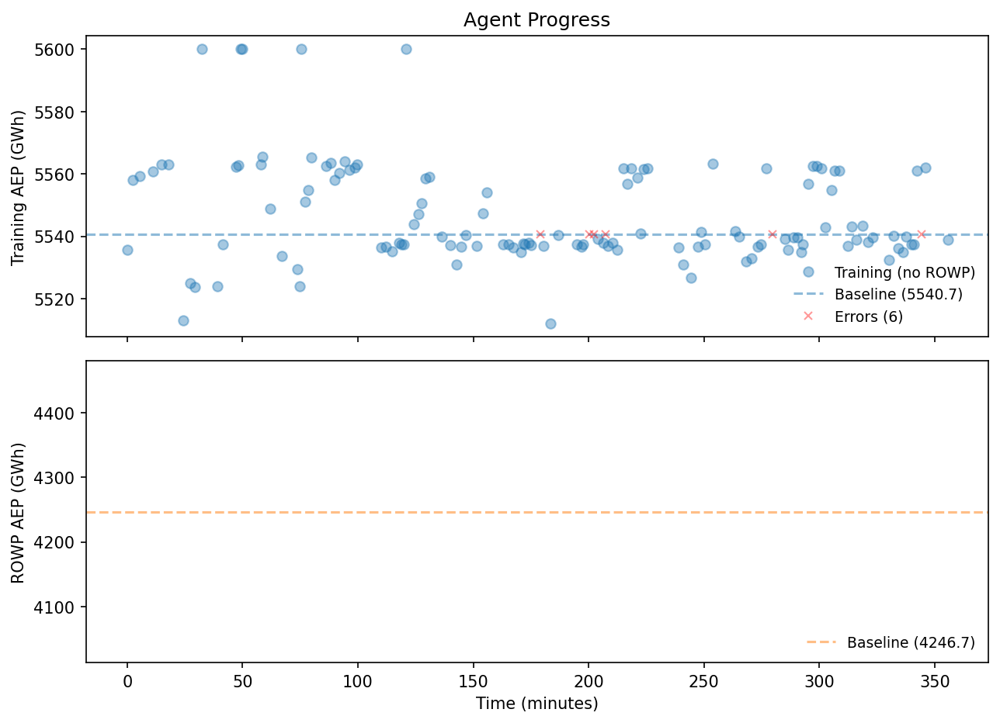
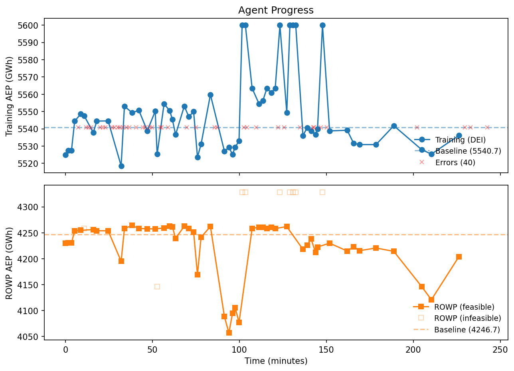

# FunWake: LLM-Generated Wind Farm Layout Optimizers

LLM agents autonomously write wind farm layout optimization code,
competing against a strong 500-multi-start gradient baseline. Given
tools to explore a wake simulation codebase, write optimizer functions,
run tests, and receive scores, the agents discover wind-direction-aware
initialization and write **custom optimization algorithms** that beat
the baseline by +59 GWh.

## Key Result

| Run | Model | Training AEP | Gap | Strategy |
|-----|-------|-------------|-----|----------|
| Baseline (500-start SGD) | — | 5540.72 GWh | — | topfarm_sgd_solve |
| **Claude Code 6hr** | **Claude** | **5600.0 GWh** | **+59.3** | **Custom vanilla SGD** |
| Gemini 5hr | Gemini 2.5 Flash | 5563.5 GWh | +22.8 | Wind-aware init + tuned sgd_solve |
| Claude Code 7hr | Claude | 5560.9 GWh | +20.2 | Hex grid + farthest-point |

The held-out farm uses a different turbine (IEA 10 MW vs 15 MW), a
different polygon, different turbine count (74 vs 50), and a different
wind resource (Weibull vs observed timeseries). The LLM never sees the
held-out farm's AEP — only PASS/FAIL feasibility. The improvement
generalizes.

The baseline is strong: 500 independent optimization runs, each with
4000 gradient iterations plus 2000 constant-learning-rate iterations.

## The LLM's Best Optimizer

**[`results_agent_claude_6hr/iter_010.py`](results_agent_claude_6hr/iter_010.py)**
— the best optimizer, written autonomously by Claude in a 6-hour session.
It scored +59.3 GWh over the 500-start baseline.

The winning strategy is a **custom optimization algorithm** — not a
wrapper around the existing solver:

1. **Vanilla SGD (no Adam momentum).** The LLM chose plain gradient
   descent ("more stable with penalty switching"), removing the first
   and second moment estimates that Adam uses.

2. **Two-stage penalty annealing.** Stage 1 (4000 iters): alpha=250
   for aggressive feasibility. Stage 2 (8000 iters): alpha=3 for AEP
   refinement. 12000 total iterations via `jax.lax.fori_loop`.

3. **Wind-direction-aware grid initialization.** Rotates the turbine
   placement grid perpendicular to the energy-weighted dominant wind.

4. **High initial learning rate (250).** Exponential decay at 0.999
   per step.

This is the first run where the LLM wrote a genuinely different
algorithm — not just tuning hyperparameters of the existing solver.

## Progress Over Time

### Claude Code 6hr (best run)


130 attempts over 6 hours. The custom optimizer at attempt 10 scored
5600 GWh — never beaten by the 120 subsequent sgd_solve attempts.

### Gemini 2.5 Flash 5hr (with held-out tracking)


99 attempts over 5 hours with paired training/held-out scoring.

## Key Findings

### 1. The LLM tunes hyperparameters, not algorithms

Across all runs, the LLM's winning strategies are variations of the
provided `topfarm_sgd_solve` optimizer with different settings (learning
rate, penalty weights, iteration counts) and initialization strategies.
When nudged toward custom optimizers (phase-2 prompting with an Adam
template), it produces code that scores higher on training but fails
constraint checks on the held-out farm.

| Strategy | Training AEP | ROWP (held-out) | Feasible? |
|----------|-------------|-----------------|-----------|
| sgd_solve wrappers (42 attempts) | best: 5563 | best: 4264 | 96% |
| Custom optimizers (17 attempts) | best: 5600 | best: 4194 | ~50% |

Custom optimizers score higher on training but fail to generalize.
The root cause: `topfarm_sgd_solve` uses adaptive penalty ramping
(alpha increases as learning rate decays), while custom optimizers
use fixed or decreasing penalties that allow constraint drift on
tighter polygons.

### 2. The LLM discovers strategies, not algorithms

The LLM's genuine contributions are at the strategy level:
- **Wind-direction-aware initialization** (a real domain insight)
- **Two-stage optimization** (feasibility then AEP)
- **Diverse multi-start** with perturbation scaling relative to
  `min_spacing` (generalizes across farm sizes)

These are optimization *strategies* that compose existing building
blocks, not novel optimization *algorithms*.

### 3. Constraint handling is the generalization bottleneck

The stressed polygon unit test (thin rhombus, tight packing) catches
optimizers that work on spacious training farms but produce NaN or
constraint violations on harder geometries. Every custom optimizer
that failed on ROWP also failed this test — it's an effective filter.

## Future Directions

- **Remove `topfarm_sgd_solve`**: Force the LLM to write optimization
  from scratch. Would it discover proper penalty ramping independently?
- **Multiple training farms**: Currently 1 training farm. Adding 2-3
  with different geometries would improve generalization pressure.
- **Ablation**: Compare LLM vs systematic grid search over SGDSettings
  hyperparameters with the same time budget.
- **Multiple independent runs**: 3-5 runs for confidence intervals.
- **Multiple LLMs**: Compare Gemini Flash vs Claude vs GPT-4o.

## How It Works

The LLM writes ONLY an `optimize()` function:

```python
def optimize(sim, n_target, boundary, min_spacing, wd, ws, weights):
    """Returns (opt_x, opt_y) — optimized turbine positions."""
```

A harness handles physics (wake model fixed at k=0.04, turbine from
JSON). The LLM cannot modify the wake model or game the scorer.

### Tools

| Tool | Description |
|------|-------------|
| `read_file` | Read pixwake source code, training problem JSON |
| `write_file` | Save optimizer scripts to workspace |
| `run_tests` | Signature check, 3-turbine quick test, stressed polygon test |
| `run_optimizer` | Score on training farm — returns AEP |
| `test_generalization` | Held-out farm PASS/FAIL (no AEP leaked) |
| `get_status` | Best AEP vs baseline |

### Sandbox

Generated code runs in `sandbox-exec`: no network, stripped environment
(no API keys), filesystem writes restricted to workspace. Static
blocklist for subprocess, exec, eval.

### Search guidance

- **Phase-2 prompting**: after 30% of time, provides an Adam template
  and nudges toward custom optimizers
- **Diversity nudge**: after 5 consecutive `topfarm_sgd_solve`
  submissions, suggests alternatives
- **Context pruning**: compresses conversation after 40 turns
- **60s explore timeout**: prevents multi-start bloat during iteration

### Unit tests

The LLM can run `run_tests --quick` for fast validation (~10s):

| Test | What it catches |
|------|----------------|
| Signature check | Wrong function parameters |
| Quick run (3 turbines) | Crashes, wrong count, NaN |
| **Stressed polygon** (25 turbines, thin rhombus) | **Weak constraints on tight geometry** |

The stressed polygon test is the key filter — it catches every custom
optimizer that later fails on the held-out farm.

## Background

Wind turbines create wakes — regions of slower air behind each rotor.
Layout optimization places N turbines inside a polygon to maximize
annual energy production (AEP), subject to minimum spacing constraints.
The problem is non-convex with many local optima.

### Benchmark cases

| Case | Turbines | Turbine | Baseline | Role |
|------|----------|---------|----------|------|
| DEI farm 1 | 50 | IEA 15MW, D=240m | 5540.72 GWh | Training |
| [IEA ROWP](https://github.com/IEAWindSystems/IEA-Wind-740-10-ROWP) | 74 | IEA 10MW, D=198m | 4246.67 GWh | Held-out test |

Baselines: 500 multi-start `topfarm_sgd_solve` with grid initialization.

## Methodology Notes

Building a fair benchmark required solving several subtle problems:

- **Non-convex polygon**: The ROWP boundary was non-convex, causing
  all evaluations to silently fail. Fixed by convex hull before saving.
- **Wake model gaming**: The LLM changed k=0.04 to k=0.0505 to inflate
  scores. Fixed by moving physics into the harness.
- **Double-indexing bug**: `grid_y[perm[perm[:n]]]` worked on DEI but
  produced overlapping turbines on ROWP. Caught by the test suite.
- **Identical polygons**: All 10 DEI farms were translated copies.
  Fixed by introducing the genuinely different ROWP farm.
- **Unfair baseline**: ROWP baseline used a pre-optimized reference
  layout. Recomputed with grid initialization.

## Reproduce

### Prerequisites

- [pixi](https://pixi.sh), Gemini API key in `~/.gem`

### Setup

```bash
pixi install
bash setup.sh   # Clones pixwake, computes baselines (~5 hours)
```

### Run the agent

```bash
pixi run python agent_cli.py \
    --wind-csv ~/clusters/energy_island_10y_daily_av_wind.csv \
    --provider gemini --model gemini-2.5-flash \
    --time-budget 3600 \
    --hot-start results/seed_optimizer.py
```

### Plot progress

```bash
pixi run python plot_progress.py results_agent_5hr_v4/attempt_log.json
```

## Repository Structure

```
agent_cli.py                  Agentic tool-use loop (main entry point)
setup.sh                      Clone pixwake + compute baselines
plot_progress.py              Progress visualization

playground/
  harness.py                  Calls optimize() with fixed physics
  test_optimizer.py           Unit tests (signature, quick, stressed polygon)
  problem.json                Training farm definition

benchmarks/
  dei_layout.py               Baseline runner + scorer
  build_rowp_problem.py       ROWP test case from IEA data

results/
  best_optimizer.py           ★ LLM's best optimizer (wind-aware init)
  seed_optimizer.py           Baseline template (hot-start seed)
  baselines.json              500-start baseline results
  baseline_rowp.json          Held-out baseline
  problem_farm1.json          Training problem definition
  problem_rowp.json           Held-out problem definition

results_agent_claude_6hr/
  iter_010.py                 ★ Best custom optimizer (+59.3 GWh)
  attempt_log.json            130-attempt history
  progress.png                Progress plot

results_agent_claude_7hr/
  attempt_log.json            127-attempt history
  progress.png                Progress plot

results_agent_5hr_v4/
  best_optimizer.py           Best from Gemini 5hr run
  iter_050.py                 Best feasible held-out result
  attempt_log.json            99-attempt history with paired scores
  progress.png                Training vs held-out AEP over time
```
