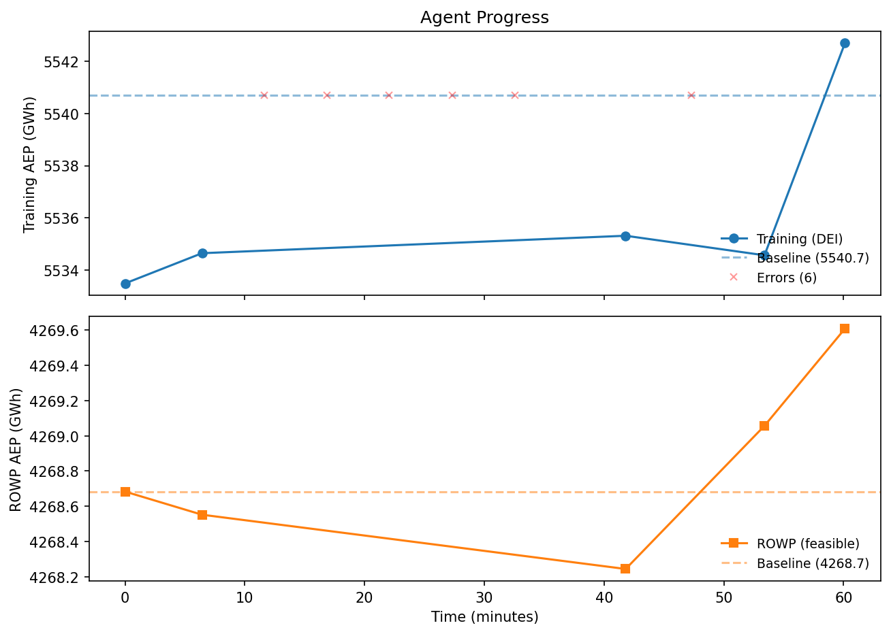

# FunWake: Can an LLM Write a Better Wind Farm Optimizer?

An LLM agent autonomously writes wind farm layout optimization code,
competing against a strong multi-start baseline. The agent explores a
wake simulation codebase, writes optimizer scripts, runs unit tests, and
iterates — with its best script evaluated on a held-out farm it never
sees during development.

## Best LLM-Generated Optimizer

The best script the agent produced
([`results_agent_1hr_v7/best_optimizer.py`](results_agent_1hr_v7/best_optimizer.py))
uses a **two-stage strategy**:

**Stage 1 — Feasibility:** Run `topfarm_sgd_solve` with heavy constraint
penalties (`spacing_weight=10, boundary_weight=10`) for 1000 iterations
to get a feasible layout from the initial positions.

**Stage 2 — AEP maximization:** From the feasible layout, run 10
multi-start optimizations with small perturbations (`0.05×D`), each with
4000 iterations at `learning_rate=30`. Keep the best.

```
Training (DEI):    5542.71 GWh  (+2.0 vs 500-start baseline)
Held-out (ROWP):   4269.61 GWh  (+0.9 vs 500-start baseline)  ✓ feasible
```

The script reads all parameters (turbine, boundary, wind rose) from a
problem JSON, so the same code works on both farms despite different
turbine sizes (D=240m vs D=198m), turbine counts (50 vs 74), and wind
resources.



## How It Works

The agent (`agent_cli.py`) is a tool-use loop powered by Gemini 2.5
Flash. It gets a time budget and these tools:

| Tool | Description |
|------|-------------|
| `read_file` | Read pixwake source code and the training problem JSON |
| `list_files` | Explore the codebase |
| `write_file` | Save scripts to the workspace |
| `run_tests` | Unit tests: turbine count, boundary, spacing, AEP validity |
| `test_generalization` | Run on a held-out farm — reports feasibility only, not AEP |
| `run_optimizer` | Score on the training farm — returns AEP |
| `get_status` | Check best AEP vs baseline |

The agent can read the training problem definition, inspect the pixwake
API, write scripts, validate them with unit tests, check they generalize
to a different farm, and then score them. It never sees the held-out
farm's AEP — only whether its script produces a feasible layout there.

Every scored attempt is silently evaluated on the held-out farm in the
background, producing paired (training, held-out) data for the progress
plot.

### Sandbox

Generated scripts run in a macOS sandbox:
- Network access blocked (`sandbox-exec`)
- Environment stripped to whitelisted vars only (no API keys)
- Filesystem writes restricted to the workspace
- Static blocklist for dangerous imports (subprocess, exec, etc.)

## Problem

Write a general wind farm layout optimizer that reads its configuration
from a JSON file:

```
rotor_diameter, hub_height, min_spacing_m, n_target,
boundary_vertices, init_x, init_y,
wind_rose (directions, speeds, weights),
turbine (power_curve, ct_curve)
```

Constraints: all turbines inside the polygon, pairwise distance >=
`min_spacing_m`. The optimizer must generalize — it's evaluated on a
farm it was never trained on.

### Benchmark Cases

| Case | Turbines | Turbine | Baseline AEP | Role |
|------|----------|---------|-------------|------|
| DEI farm 1 | 50 | IEA 15MW, D=240m | 5540.72 GWh | Training |
| [IEA ROWP](https://github.com/IEAWindSystems/IEA-Wind-740-10-ROWP) | 74 | IEA 10MW, D=198m | 4268.68 GWh | Held-out test |

Baselines: 500 multi-start `topfarm_sgd_solve` (`max_iter=4000`,
`additional_constant_lr_iterations=2000`).

## Reproduce

### Prerequisites

- [pixi](https://pixi.sh)
- Gemini API key in `~/.gem`
- Wind resource CSV (10-year Danish Energy Island daily averages)

### Setup

```bash
pixi install
bash setup.sh    # clones pixwake, computes baselines (~5 hours)
```

### Run the agent

```bash
# 1-hour session with hot start from the baseline template
pixi run python agent_cli.py \
    --wind-csv ~/clusters/energy_island_10y_daily_av_wind.csv \
    --provider gemini --model gemini-2.5-flash \
    --time-budget 3600 \
    --hot-start results/seed_optimizer.py

# Plot progress
pixi run python plot_progress.py results_agent/attempt_log.json
```

### Run unit tests on a script

```bash
PYTHONPATH=playground/pixwake/src pixi run python \
    playground/test_optimizer.py my_optimizer.py playground/problem.json
```

## Repository Structure

```
agent_cli.py                  Agentic tool-use loop (main entry point)
agent.py                      Fixed-loop agent (earlier iteration)
benchmarks/
  dei_layout.py               Benchmark suite + baseline runner
  build_rowp_problem.py       Builds ROWP test case from IEA data
playground/
  problem.json                Training farm definition
  test_optimizer.py           Unit test suite for optimizer scripts
  pixwake/                    Wake simulation library (cloned by setup.sh)
results/
  baselines.json              500-start baseline results
  baseline_rowp.json          ROWP baseline
  problem_farm1.json          Training problem definition
  problem_rowp.json           Held-out problem definition
  seed_optimizer.py           Generic baseline template
results_agent_1hr_v7/
  best_optimizer.py           Best LLM-generated optimizer
  attempt_log.json            Per-attempt training + held-out scores
  progress.png                Progress plot
plot_progress.py              Standalone plotting script
setup.sh                      Setup: clone pixwake + compute baselines
```
