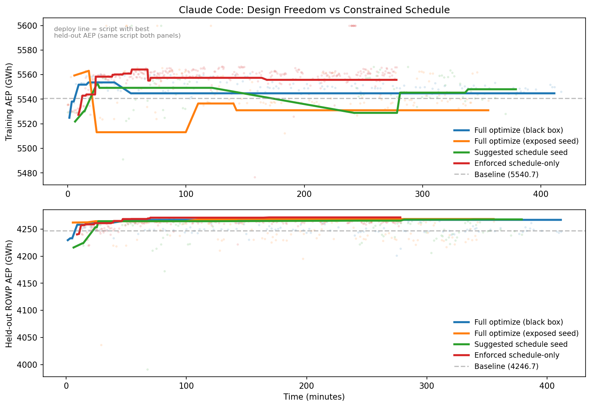
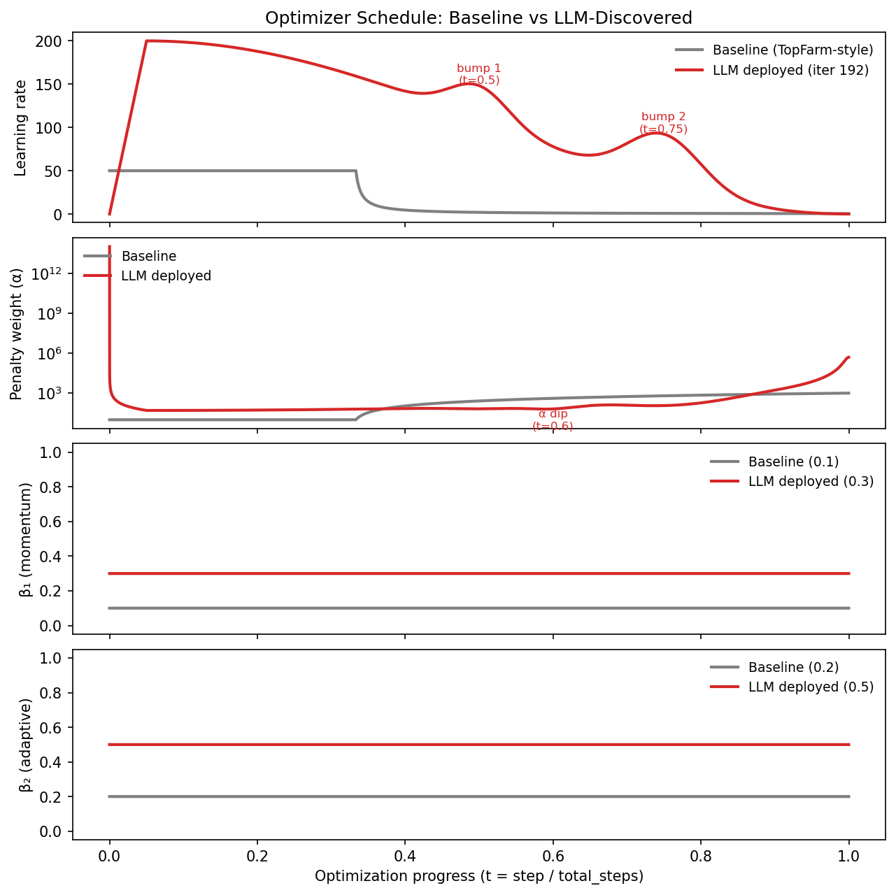
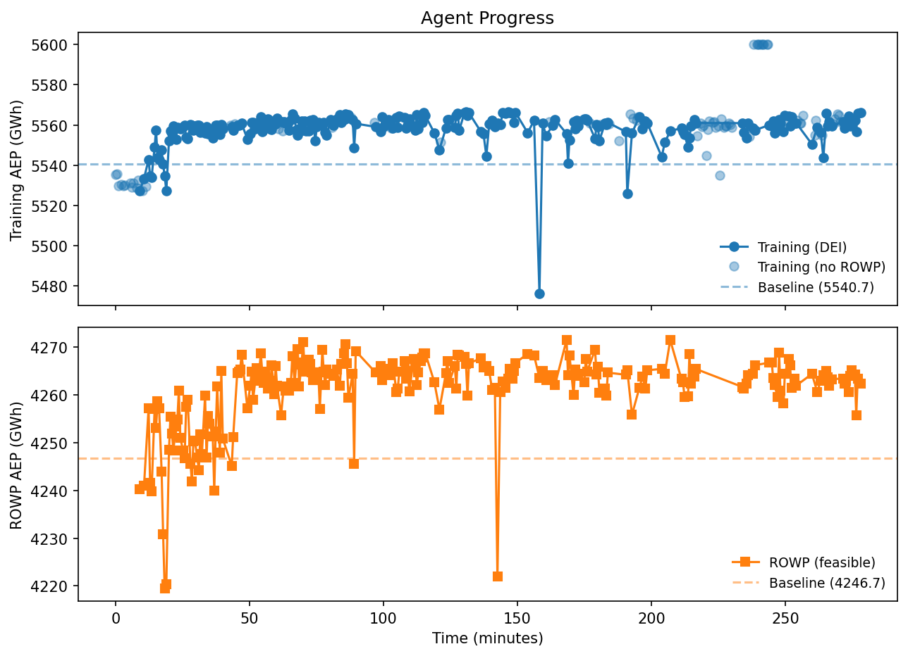

# FunWake: LLM-Discovered Optimizer Schedules for Wind Farm Layout

An LLM agent writes wind farm layout optimization code, competing
against a 500-multi-start gradient baseline. The key finding:
**constraining the LLM to write only a 4-parameter schedule function
-- not the full optimizer -- produces 3x more attempts, 100% novel
code, and the best generalization to unseen farms.**

The winning schedule, discovered autonomously by Claude Code over 320
iterations, combines asymmetric cosine decay with a late-stage
Gaussian learning-rate bump -- a pattern not present in standard
optimizers or the training literature we are aware of.



*Running-best AEP over time for four levels of LLM autonomy.
Top: Training farm. Bottom: Held-out ROWP farm. All approaches
reach similar peaks on training, but the constrained schedule-only
mode (red) sustains improvement across 320 iterations and achieves
the best held-out generalization.*

## Results

### The comparison: from full freedom to constrained search

All runs use Claude Code. The progression shows that **less freedom
produces better results**.

| Approach | Attempts | Custom | Best Train (GWh) | Best ROWP (GWh) | Key discovery |
|----------|----------|--------|-------------------|------------------|---------------|
| Full optimize (black box) | 121 in 7hr | 2% | 5560.9 (+20.1) | 4267.0 (+20.3) | Hex grid + farthest-point init |
| Full optimize (exposed seed) | 124 in 6hr | 4% | 5600.0 (+59.3) | 4268.5 (+21.8) | Custom vanilla SGD, no Adam |
| Suggested schedule seed | 96 in 6hr | 18% | 5600.0 (+59.3) | 4267.8 (+21.1) | Custom Adam + momentum restarts |
| **Enforced schedule-only** | **320 in 5hr** | **100%** | **5600.0 (+59.3)** | **4271.5 (+24.8)** | **Asymmetric cosine + Gaussian bump** |

Baselines: Training 5540.72 GWh, ROWP 4246.67 GWh (both 500
multi-start SGD with grid initialization).

### Why constraining the search space works

When given full freedom, the LLM spends most of its time on
boilerplate: boundary checking, initialization, JAX compilation
issues, and multi-start scaffolding. Only 2-4% of attempts contain
genuinely novel optimization code. The rest are variations of the
provided solver with different hyperparameters.

The schedule-only mode applies the
[FunSearch](https://deepmind.google/discover/blog/funsearch-making-new-discoveries-in-mathematical-sciences/)
pattern: a human writes the fixed skeleton (Adam loop, gradient
computation, constraint penalties) and the LLM writes only the
creative part (a `schedule_fn` that returns `lr, alpha, beta1, beta2`
at each step). This produces:

- **3x more attempts** (320 vs ~120 in the same wall time)
- **100% novel code** -- every attempt is a different schedule
- **Best held-out generalization** (+24.8 GWh on unseen farm)
- **Gradual improvement** -- not a lucky early shot

### Held-out generalization

The held-out farm uses a **different turbine** (IEA 10 MW vs 15 MW),
**different polygon**, **different turbine count** (74 vs 50), and
**different wind resource** (Weibull vs observed timeseries). The LLM
never sees the held-out AEP -- only PASS/FAIL feasibility.

| Case | Turbines | Turbine | Baseline | Best LLM | Gap |
|------|----------|---------|----------|----------|-----|
| DEI farm 1 (training) | 50 | IEA 15 MW, D=240 m | 5540.72 GWh | 5600.0 GWh | **+59.3** |
| [IEA ROWP](https://github.com/IEAWindSystems/IEA-Wind-740-10-ROWP) (held out) | 74 | IEA 10 MW, D=198 m | 4246.67 GWh | 4271.5 GWh | **+24.8** |

## The deployed schedule

**[`results_agent_schedule_only_5hr/iter_192.py`](results_agent_schedule_only_5hr/iter_192.py)**
-- the script you'd ship. Best held-out ROWP AEP (4271.5 GWh),
written by Claude Code at iteration 192 of 320.

```python
def schedule_fn(step, total_steps, lr0, alpha0):
    t = step / total_steps
    lr_init = 4.0 * lr0
    lr_min = lr_init / 10000.0

    # 5% warmup + cosine decay
    warmup_end = 0.05
    warmup_lr = lr_init * t / warmup_end
    cosine_t = (t - warmup_end) / (1.0 - warmup_end)
    cosine_lr = lr_min + (lr_init - lr_min) * 0.5 * (1 + cos(pi * cosine_t))
    lr_base = warmup_lr if t < 0.05 else cosine_lr

    # Two Gaussian LR bumps: escape windows at 50% and 75%
    bump1 = 0.2 * lr_init * exp(-0.5 * ((t - 0.5) / 0.04)^2)
    bump2 = 0.3 * lr_init * exp(-0.5 * ((t - 0.75) / 0.05)^2)
    lr = lr_base + bump1 + bump2

    # Penalty: 5x coupled to 1/LR + quadratic late boost
    alpha_base = 5 * alpha0 * lr_init / lr
    alpha_extra = 3 * alpha0 * max(t - 0.5, 0)^2
    # Alpha DIP at t=0.6: relax constraints between bumps
    dip = 0.5 * exp(-0.5 * ((t - 0.6) / 0.04)^2)
    alpha = (alpha_base + alpha_extra) * (1 - dip)

    beta1, beta2 = 0.3, 0.5
    return lr, alpha, beta1, beta2
```

### What makes this schedule novel

**Learning rate** uses cosine decay with two Gaussian bumps that
briefly *increase* the step size at 50% and 75% completion — controlled
escapes from local optima. Standard schedules decay monotonically.

**Penalty weight** is coupled to 1/LR (so it increases as LR decays,
enforcing feasibility), but with an intentional **dip at t=0.6** —
between the two LR bumps. This temporarily relaxes constraints to let
the layout rearrange before the final convergence phase tightens
everything. The LR bumps and alpha dip are coordinated: the schedule
knows *when* to explore (bumps) and *when* to enforce (everywhere else).

**Momentum** at beta1=0.3, beta2=0.5 is a novel sweet spot between
TopFarm's aggressive low values (0.1, 0.2) and standard Adam's high
values (0.9, 0.999). The LLM explored 24 distinct beta pairs over 320
iterations and converged on this one.

| Component | Discovered at | Effect |
|-----------|--------------|--------|
| 4× initial LR | iter 23 | Larger exploration basin |
| 5% linear warmup | iter 11 | Stabilizes early Adam at high LR |
| Cosine base decay | iter 1 (seed) | Smooth annealing |
| Gaussian bump at t=0.5 | iter 120 | Mid-optimization escape |
| Gaussian bump at t=0.75 | iter 124 | Late-stage escape |
| 5× alpha coupling | iter 153 | Stronger constraint enforcement |
| Quadratic alpha boost | iter 1 (seed) | Extra feasibility in final 50% |
| Alpha dip at t=0.6 | iter 183 | Relax constraints between bumps |
| beta1=0.3, beta2=0.5 | iter 93 | Moderate momentum sweet spot |

Each component was discovered independently and validated through
empirical feedback before being combined in this final schedule.

### Baseline vs LLM schedule



*All four optimizer parameters over optimization progress. Gray:
TopFarm-style baseline (monotonic decay, low momentum). Red:
LLM-discovered schedule (dual bumps, alpha dip, moderate momentum).
The coordinated structure — bumps in LR with a dip in penalty —
is the key innovation.*

### Schedule-only progress



*320 schedule attempts over 5 hours. Each point is a different
`schedule_fn`. Training AEP (top) and held-out ROWP (bottom).*

## Background

Wind turbines create wakes -- regions of slower air. Layout
optimization places N turbines inside a polygon to maximize annual
energy production (AEP), subject to spacing constraints. The problem
is non-convex with many local optima.

## Method

### The skeleton pattern

The LLM writes ONLY a schedule function. A fixed skeleton handles
everything else:

```
Human writes (fixed):          LLM writes (evolved):
  Grid initialization            schedule_fn(step, total, lr0, alpha0)
  Objective + gradients             -> lr      (learning rate)
  Adam update rule                  -> alpha   (penalty weight)
  Constraint penalties              -> beta1   (1st moment decay)
  Convergence                       -> beta2   (2nd moment decay)
```

### Tools

| Tool | Description |
|------|-------------|
| `run_tests` | Signature check, quick test, stressed polygon test |
| `run_optimizer` | Score on training farm -- returns AEP |
| `test_generalization` | Held-out farm PASS/FAIL (no AEP leaked) |
| `get_status` | Best AEP vs baseline |

### Methodology notes

- **Non-convex polygon**: ROWP boundary was non-convex, silently failing. Fixed by convex hull.
- **Wake model gaming**: LLM changed k parameter. Fixed by moving physics into harness.
- **Identical polygons**: All 10 DEI farms were copies. Fixed with genuinely different ROWP farm.
- **Unfair baseline**: ROWP used pre-optimized layout. Recomputed with grid init.

## Reproduce

```bash
pixi install
bash setup.sh                    # Clone pixwake + compute baselines

# Schedule-only mode (best)
pixi run python agent_cli.py \
    --provider claude-code --schedule-only \
    --hot-start results/seed_schedule.py \
    --time-budget 18000

# Full optimize mode
pixi run python agent_cli.py \
    --provider claude-code \
    --hot-start results/seed_optimizer.py \
    --time-budget 21600

# Plot
pixi run python plot_comparison.py --save comparison.png
```

## Repository structure

```
agent_cli.py                              Main entry point
runners/                                  LLM backends (Claude Code, Gemini, vLLM)
tools/                                    Standalone tool scripts
playground/
  skeleton.py                             Fixed Adam loop (schedule-only mode)
  harness.py                              Calls optimize()/schedule_fn()
  test_optimizer.py                       Unit tests
results/
  seed_schedule.py                        Starting schedule (hot-start)
  seed_optimizer.py                       Starting optimizer (hot-start)
results_agent_schedule_only_5hr/
  iter_262.py                             * Best discovered schedule
  attempt_log.json                        320-attempt history
  progress.png                            Progress plot
results_agent_claude_6hr/
  iter_010.py                             * Best custom optimizer
```
