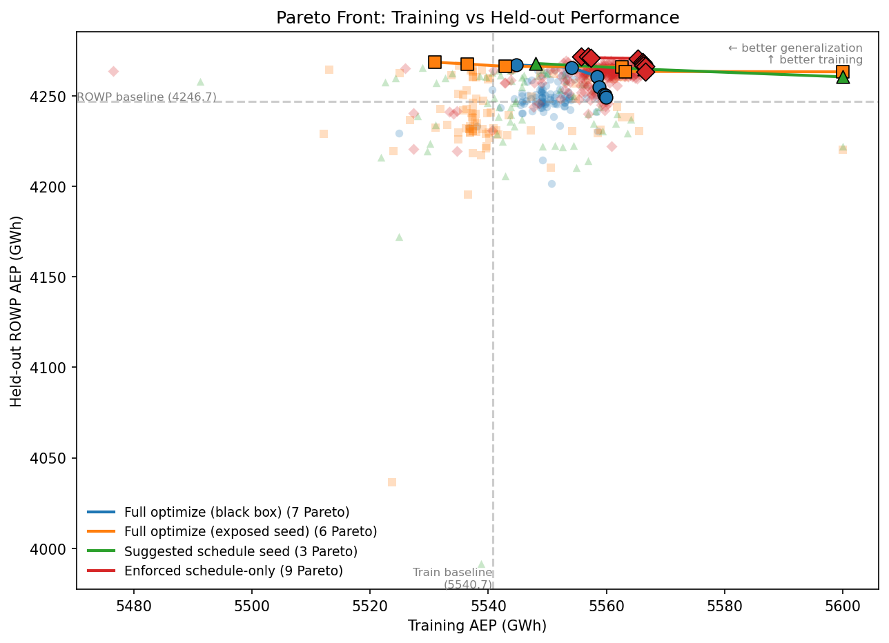

# FunWake: LLM-Discovered Optimizer Schedules for Wind Farm Layout

**Bottom line:** An LLM constrained to write only a 4-parameter schedule function -- not the full optimizer -- discovers a novel learning-rate schedule with dual Gaussian bumps and a coordinated penalty dip that beats a 500-multi-start baseline by +24.8 GWh on a held-out farm the LLM never trained on. The deployed script is [`results_agent_schedule_only_5hr/iter_192.py`](results_agent_schedule_only_5hr/iter_192.py).

## Comparison: less freedom produces better results

All runs use Claude Code. Constraining the search to schedule-only yields 3x more attempts, 100% novel code, and the best held-out generalization.

| Approach | Attempts | % Custom | ROWP +GWh (held out) |
|----------|----------|----------|----------------------|
| Full optimize (black box) | 121 | 2% | +20.3 |
| Full optimize (exposed seed) | 124 | 4% | +21.8 |
| Suggested schedule seed | 96 | 18% | +21.1 |
| **Schedule-only (deployed)** | **320** | **100%** | **+24.8** |

Baselines: Training 5540.7 GWh, ROWP 4246.7 GWh (500 multi-start SGD, grid init).


*Running-best AEP for four levels of LLM autonomy. The deploy line
tracks the single script with the best held-out AEP at each point
in time — the same script on both panels.*

## The deployed schedule

Iteration 192 of 320. Best held-out ROWP AEP: **4271.5 GWh (+24.8)**.

```python
def schedule_fn(step, total_steps, lr0, alpha0):
    t = step / total_steps

    # Cosine decay with 5% warmup, 4x initial LR
    lr_base = warmup_then_cosine(t, lr_init=4*lr0)

    # Two Gaussian LR bumps: escape local optima at 50% and 75%
    bump1 = 0.2 * lr_init * exp(-0.5 * ((t - 0.5) / 0.04)**2)
    bump2 = 0.3 * lr_init * exp(-0.5 * ((t - 0.75) / 0.05)**2)
    lr = lr_base + bump1 + bump2

    # Penalty coupled to 1/LR, with intentional dip at t=0.6
    alpha = 5 * alpha0 * lr_init / lr + quadratic_late_boost
    alpha *= (1 - 0.5 * gaussian_dip(t, center=0.6))

    beta1, beta2 = 0.3, 0.5  # moderate momentum
    return lr, alpha, beta1, beta2
```

Full source: [`results_agent_schedule_only_5hr/iter_192.py`](results_agent_schedule_only_5hr/iter_192.py)

### What makes it novel

**Dual Gaussian LR bumps** briefly increase step size at t=0.5 and
t=0.75 -- controlled escapes from local optima. Standard schedules
decay monotonically.

**Coordinated alpha dip at t=0.6** relaxes constraint penalties between
the two bumps, letting the layout rearrange before final convergence.
The bumps and dip form a coordinated explore-then-enforce cycle.

**Moderate momentum** (beta1=0.3, beta2=0.5) between TopFarm's lows
(0.1, 0.2) and standard Adam (0.9, 0.999). Converged on after
exploring 24 distinct beta pairs.

| Component | Discovered at | Effect |
|-----------|--------------|--------|
| 4x initial LR | iter 23 | Larger exploration basin |
| 5% linear warmup | iter 11 | Stabilizes early Adam |
| Gaussian bump at t=0.5 | iter 120 | Mid-optimization escape |
| Gaussian bump at t=0.75 | iter 124 | Late-stage escape |
| 5x alpha coupling | iter 153 | Stronger constraint enforcement |
| Alpha dip at t=0.6 | iter 183 | Relax constraints between bumps |
| beta1=0.3, beta2=0.5 | iter 93 | Moderate momentum sweet spot |


*All four parameters over optimization progress. Gray: baseline
(monotonic decay, low momentum). Red: LLM-discovered (dual bumps,
alpha dip, moderate momentum).*

## Held-out generalization

The held-out farm differs in turbine (IEA 10 MW vs 15 MW), polygon,
turbine count (74 vs 50), and wind resource (Weibull vs timeseries).
The LLM sees only PASS/FAIL feasibility, never the AEP.

| Case | Turbines | Baseline | Best LLM | Gap |
|------|----------|----------|----------|-----|
| DEI farm 1 (train) | 50, IEA 15 MW | 5540.7 GWh | 5600.0 GWh | +59.3 |
| [IEA ROWP](https://github.com/IEAWindSystems/IEA-Wind-740-10-ROWP) (held out) | 74, IEA 10 MW | 4246.7 GWh | 4271.5 GWh | +24.8 |



*Pareto front: schedule-only (red) dominates the upper-right corner
with 9 Pareto-optimal scripts.*

## Search progress


*Each point is a different `schedule_fn`. Gradual improvement over
320 iterations, not a lucky early shot.*

## Method

The LLM writes ONLY a schedule function. A fixed skeleton handles
gradients, Adam updates, constraints, and wind-aware grid
initialization -- the
[FunSearch](https://deepmind.google/discover/blog/funsearch-making-new-discoveries-in-mathematical-sciences/)
pattern applied to optimizer schedules.

```
Human writes (fixed):          LLM writes (evolved):
  Grid initialization            schedule_fn(step, total, lr0, alpha0)
  Objective + gradients             -> lr, alpha, beta1, beta2
  Adam update rule
  Constraint penalties
```

See [`CLAUDE.md`](CLAUDE.md) for architecture details and
[`paper/`](paper/) for the manuscript draft.

## Reproduce

```bash
pixi install && bash setup.sh    # clone pixwake + compute baselines

# Schedule-only mode (best)
pixi run python agent_cli.py \
    --provider claude-code --schedule-only \
    --hot-start results/seed_schedule.py \
    --time-budget 18000

# Plots
pixi run python plot_comparison.py --save comparison.png
pixi run python plot_schedules.py --save schedules.png
pixi run python plot_pareto.py --save pareto.png
```
