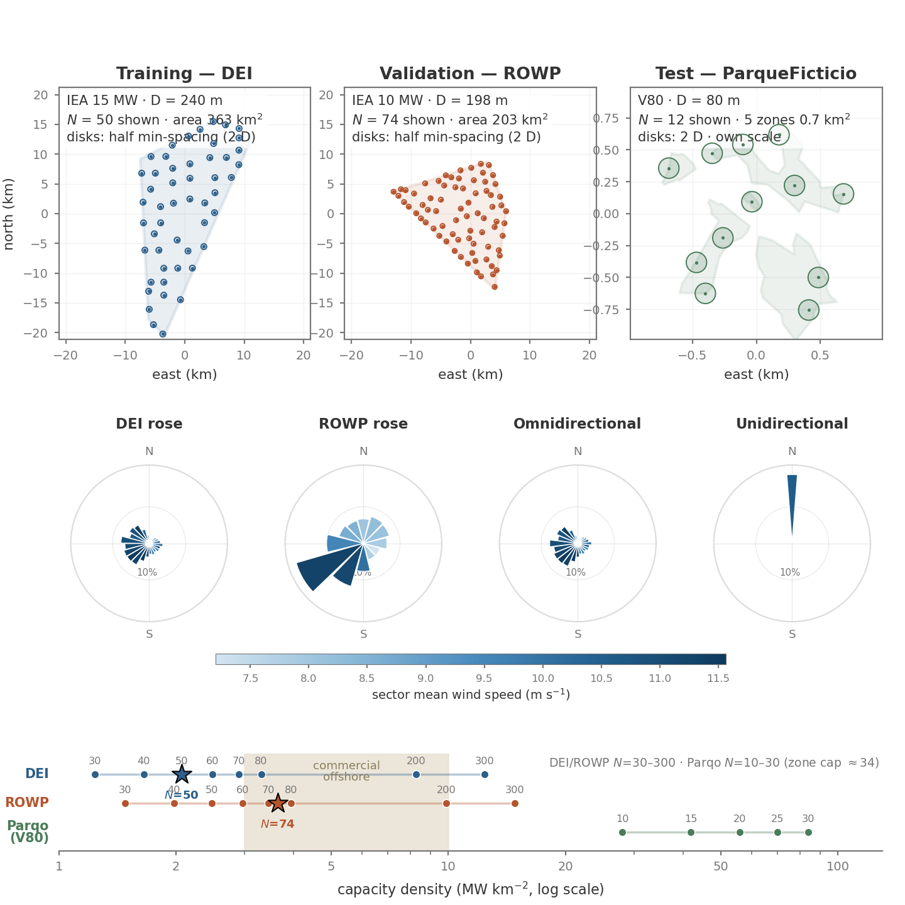
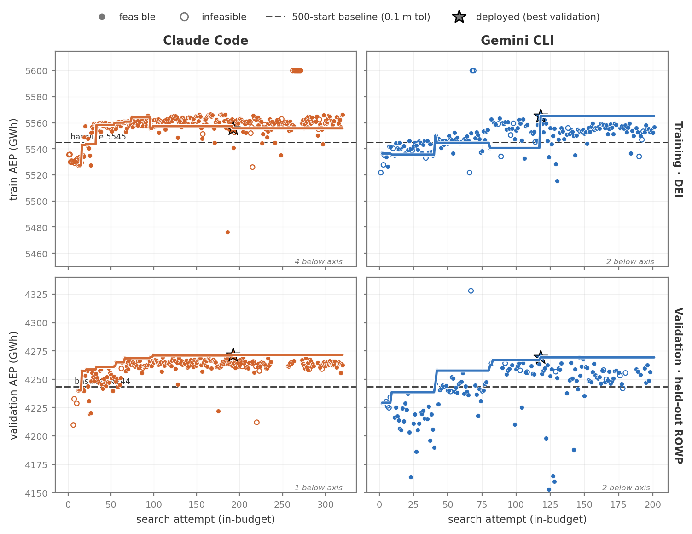
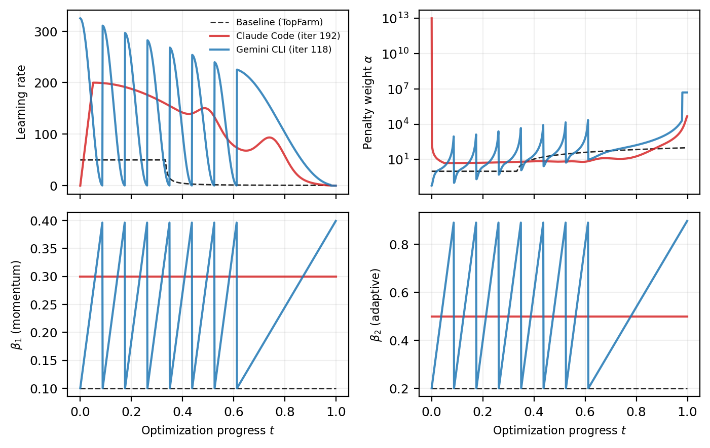
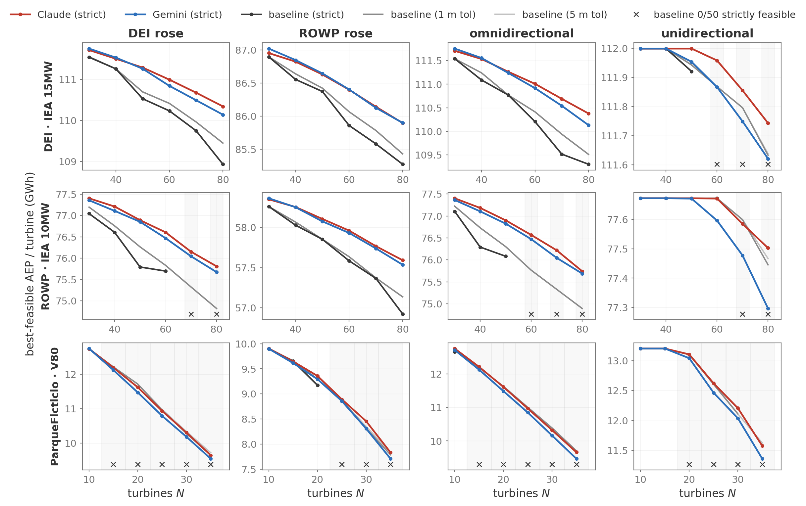

# FunWake: LLM-Discovered Optimizer Schedules for Wind Farm Layout

[](https://github.com/kilojoules/funwake/actions/workflows/smoke.yml)

Wind farm layout optimization is a non-convex constrained problem in
which a half-percent gain in annual energy production (AEP) is worth
millions of dollars per farm. FunWake applies the FunSearch paradigm to
it: LLM coding agents iteratively write optimizer *schedules*, evaluated
on wind farms held out from the search.

The headline finding is that **constraining the agent helps**. An agent
allowed to write only a 4-parameter schedule function, not the full
optimizer, discovers a novel learning-rate schedule that beats a
500-multistart baseline by +24.8 GWh on a held-out farm it never trained
on.

Deployed script: [`runs/schedule_only_5hr/iter_192.py`](runs/schedule_only_5hr/iter_192.py).

Low cost: each candidate scores in ~30 s on CPU (median 28.7 s over the
deployed run), so a 5-hour search covers a few hundred schedules (423 for
the deployed Claude run). See [What a run costs](#what-a-run-costs).

---

## Quick start

You do not need API keys, a wind CSV, or the discovery loop to start.
The scoring tools read a self-contained problem file (wind resource
included), so you can write a schedule and score it immediately.

```bash
pixi install          # Python env
bash setup.sh          # vendored pixwake + committed baselines (fast; no recompute)

# Score the seed schedule on the training farm (schedule-only mode)
pixi run python tools/run_optimizer.py results/seed_schedule.py --schedule-only
# -> {"aep_gwh": 5529.2, "feasible": false, "baseline": 5540.72, "gap": -11.51}

# Score the deployed (best) schedule
pixi run python tools/run_optimizer.py \
    runs/schedule_only_5hr/iter_192.py --schedule-only
```

The seed scores *below* the baseline and sits right at the feasibility
boundary — it reports `"feasible": false` on the reference platform, though
the exact flag can flip across CPU architectures via float drift. The
baseline (5540.72) is the best *feasible* layout of 500 multistarts, so the
game is to gain AEP *while* holding feasibility (the deployed schedule
scores 5561.58, comfortably feasible). `tools/run_tests.py` on the seed
reports one expected-fail (`[XFAIL] stressed_boundary`) and still exits
green.

That is the whole loop: write a `schedule_fn`, score it, iterate. See
[Write your own schedule](#write-your-own-schedule) below.

> ### ⚠️ Use schedule-only mode
>
> FunWake has two modes. **Stay in schedule-only mode** (the `--schedule-only`
> flag, and the recommended harness).
>
> In schedule-only mode the agent controls just four numbers per step
> and a fixed, JAX-compiled skeleton does the optimization. It is fast,
> scales to large N, and every candidate is a fair apples-to-apples
> comparison on the same solver.
>
> The other mode (full-optimize) lets the agent write the *entire*
> optimizer. Agents there tend to rediscover general-purpose algorithms
> (e.g. SLSQP) that **do not scale**: run time blows past the per-run
> timeout on larger wind farms and results get unreliable. Unless you are
> specifically studying that failure mode, do not use it. The paper's
> results, and this README's workflow, are schedule-only.

---

## How FunWake works

The LLM writes ONLY a schedule function. A fixed skeleton handles grid
initialization, gradients, Adam updates, and constraint penalties: the
[FunSearch](https://deepmind.google/discover/blog/funsearch-making-new-discoveries-in-mathematical-sciences/)
pattern applied to optimizer schedules.

```
Human writes (fixed):          LLM writes (evolved):
  Grid initialization            schedule_fn(step, total, lr0, alpha0)
  Objective + gradients             -> lr, alpha, beta1, beta2
  Adam update rule
  Constraint penalties
```

The skeleton is TopFarm's SGD solver. Each step it combines the AEP
gradient with `alpha` times the constraint (boundary + spacing) gradient
and takes an Adam step at the scheduled `lr`, `beta1`, `beta2`. It runs
8000 steps. FunWake deliberately omits TopFarm's early-stopping step, so
the schedule itself has to balance objective against constraints all the
way to convergence.

**The problem being solved:** place N turbines to maximize AEP inside the
allowed area, subject to two constraints, every turbine stays inside the
boundary (and out of exclusion zones), and no two turbines sit closer
than a minimum spacing. AEP comes from a wind resource (direction and
speed sectors) and a Bastankhah wake model.

---

## Write your own schedule

The interface is one function. It returns the four control parameters at
each step:

```python
import jax.numpy as jnp

def schedule_fn(step, total_steps, lr0, alpha0):
    """
    step:        current iteration (0 .. total_steps-1)
    total_steps: 8000
    lr0:         initial learning rate (50.0)
    alpha0:      initial penalty weight (from gradient magnitude)

    returns: (lr, alpha, beta1, beta2)
      lr    - step size
      alpha - constraint penalty multiplier (higher = stricter)
      beta1 - Adam momentum (0.9 high, 0.1 low)
      beta2 - Adam adaptive scaling (0.999 standard)
    """
    t = step / total_steps
    lr = lr0 * (1 - t)          # simple linear decay, replace with your idea
    alpha = alpha0 * (1 + 4*t)  # ramp penalty up as lr decays
    return lr, alpha, 0.3, 0.5
```

Start from the seed: [`results/seed_schedule.py`](results/seed_schedule.py)
(TopFarm's coupled `alpha` ~ 1/lr law), and read
[`playground/skeleton.py`](playground/skeleton.py) to see exactly what
the fixed optimizer does.

Save each attempt to its own file (never overwrite), then:

```bash
# 1. Score on the training farm (DEI, N=50)
pixi run python tools/run_optimizer.py myschedules/iter_001.py --schedule-only \
    --log myschedules/attempt_log.json

# 2. Quick unit checks (returns correct shapes, finite, feasible-ish)
pixi run python tools/run_tests.py myschedules/iter_001.py --quick

# 3. Held-out generalization (IEA ROWP, never seen during search)
pixi run python tools/test_generalization.py myschedules/iter_001.py --schedule-only

# 4. Progress so far
pixi run python tools/get_status.py --log myschedules/attempt_log.json
```

Baselines to beat: **training 5540.7 GWh**, **held-out ROWP 4246.7 GWh**
(500 multi-start SGD). Timeout is 180 s per run.

Ideas that paid off in the search: cosine decay with an initial LR boost,
brief Gaussian LR bumps to escape local optima, a penalty dip between
bumps, and tuning the Adam betas (TopFarm uses 0.1 / 0.2, standard Adam
0.9 / 0.999, the discovered sweet spot was 0.3 / 0.5).

---

## Run the full discovery loop (advanced, optional)

To reproduce the agentic search you need a provider CLI + credentials
(Claude Code or Gemini CLI) and a wind timeseries CSV. Each iteration is
a fresh, headless `claude -p` / `gemini -p` call in a loop under a
wall-clock budget; context flows between iterations only through files
(an auto-loaded config, a log of past attempts' AEP, and the earlier
candidate scripts).

```bash
pixi run python agent_cli.py \
    --provider claude-code --schedule-only \
    --wind-csv dependencies/pixwake/energy_island_10y_daily_av_wind.csv \
    --hot-start results/seed_schedule.py \
    --time-budget 18000            # 5 hours
```

`--wind-csv` is required; the vendored training resource
(`dependencies/pixwake/energy_island_10y_daily_av_wind.csv`) works, or
supply your own. Keep `--schedule-only` (see the warning above).

**Wind CSV format.** `benchmarks/dei_layout.py` reads it (semicolon-delimited,
header row) and reduces it to a 24-bin wind rose. Required columns: `WS_150`
(wind speed, m/s) and `WD_150` (direction, degrees 0–360); a leading date
column is ignored. Only the empirical (speed, direction) distribution matters,
so row count and timestep are cosmetic. For a reproducible **synthetic**
stand-in (not real resource data), run `pixi run python
scripts/make_sample_wind.py` to write `data/sample_wind_synthetic.csv`.

**Sandboxing.** Before running, each LLM-written script passes a static AST
safety check (`sandbox.py`): imports are restricted to an allowlist (`jax`,
`numpy`, `scipy`, `math`, `time`, `functools`, `pixwake`) and escape builtins
(`exec`, `eval`, `__import__`, `getattr`, dunder tricks) are rejected; it then
runs in a **separate subprocess with a wall-clock timeout** (180 s). This is a
lightweight guardrail, not a hardened sandbox (no OS resource limits or
filesystem jail), so run agent-written scripts where executing arbitrary
numpy/JAX is acceptable. (The MCP server below applies its own AST check on
writes.)

---

## Optional: MCP interface (not the paper's run path)

The paper's discovery runs drove `claude -p` / `gemini -p` directly with
shell tools (the paper's Appendix A) and never loaded an MCP server.
`funwake_mcp.py` is a separate, optional interface: it exposes the same
five FunWake tools (`run_optimizer`, `run_tests`, `get_status`,
`read_file`, `write_file`) over MCP, for interactive use or for pointing
an external MCP-capable agent at FunWake.

Register it manually for Claude Code (project-local scope, so no shared
config file is written):

```bash
claude mcp add funwake -- pixi run python funwake_mcp.py
```

The server defaults to the training farm (`playground/problem.json`) and
`results/baselines.json` (run `bash setup.sh` first), writes candidate
scripts to `results_agent_mcp/` (override with `--output-dir`), and injects
the pixwake `PYTHONPATH` for its own tool subprocesses. For JSON-config
clients (Claude Desktop, Cursor), see `funwake_mcp.example.json`.

This is deliberately **not** wired into the search harness, and there is no
root `.mcp.json`, so `pixi install && bash setup.sh` reproductions stay
identical to the paper setup. Wiring MCP into the runner would enable a
shell-tools-vs-MCP-tools scaffold comparison — future work, not done here.

---

## What a run costs

The title's "low-cost" claim, computed from the two deployed schedule-only
runs (`runs/schedule_only_5hr/attempt_log.json`,
`runs/gemini_cli_5hr/attempt_log.json`, field `train_time`):

| run | attempts | feasible | median eval | eval hardware |
|-----|----------|----------|-------------|---------------|
| Claude (deployed) | 423 | 365 | 28.7 s | CPU |
| Gemini | 273 | 243 | 27.6 s | CPU |

Each candidate is one 8000-step skeleton run scored on CPU (~28 s median,
8–68 s range); the first run in a fresh process also pays JIT compilation.
A 5-hour budget covers a few hundred schedules. (Gemini's log spans ~3.7 h
of active work, so its 273 is not a full 5-hour yield.) The logs record
wall time but **no LLM token counts or API cost** — TODO(human): API spend
per lane is not logged. Evaluation hardware is reported only as "CPU"
(`paper/short.tex`); the specific processor is TODO(human).

---

## Wind farm cases

| Role | Farm | Turbines | Notes |
|------|------|----------|-------|
| Train | DEI farm 1 | 50, IEA 15 MW | Danish Energy Island tender |
| Validation (held out) | [IEA ROWP](https://github.com/IEAWindSystems/IEA-Wind-740-10-ROWP) | 74, IEA 10 MW | different polygon, Weibull wind |
| Test | Parque Ficticio | V80 | small multi-zone onshore |

The agent optimizes on the train farm and may check only *feasibility*
(never AEP) on the validation farm. The deployed script is the one with
the best validation AEP that stayed feasible on both. Each case is run
against four wind roses: the real DEI and ROWP roses, plus
omnidirectional and unidirectional limiting cases.



*Train (DEI), validation (ROWP), and test (Parque Ficticio) layouts
(top), the four wind roses (middle), and capacity density across the
cases (bottom).*

---

## Results

### Less freedom, better results

All four lanes use Claude Code and differ only in how much the agent
controls. Constraining the search to schedule-only yields 3x more
attempts, 100% novel code, and the best held-out generalization.

| Approach | Attempts | % Custom | ROWP +GWh (held out) |
|----------|----------|----------|----------------------|
| Full optimize (black box) | 121 | 2% | +20.3 |
| Full optimize (exposed seed) | 124 | 4% | +21.8 |
| Suggested schedule seed | 96 | 18% | +21.1 |
| **Schedule-only (deployed)** | **320** | **100%** | **+24.8** |

Model choice moves the result less than scaffolding does. At the same
schedule-only scaffold, Claude Code reaches 4271.5 GWh on the held-out
farm and Gemini CLI reaches 4269.3 GWh: that 2 GWh model spread is
smaller than the 4.5 GWh spread across the four scaffolds above.

A third model lane (ChatGPT-Codex, six runs under
`runs/codex_{sched,fullopt}_run1-3`) completed and beat the training
baseline (best 5567.9 / 5584.5 GWh) but is **not** in the headline: none of
those runs has a held-out ROWP score, so they cannot enter the ROWP-keyed
comparison, and they were collected for a separate Codex write-up now
archived under `paper/archive/`. TODO(human): state whether this is a
deliberate exclusion or pending analysis.

### The schedule search



*Each dot is one candidate schedule run through the fixed skeleton;
filled dots are feasible layouts. Columns are Claude Code and Gemini CLI;
rows are train AEP (DEI) and held-out AEP (ROWP). The solid line traces
the best feasible validation AEP so far, the dashed line is the
500-multistart baseline, and the star marks the deployed schedule.*

### The deployed schedule (iter 192)

Best held-out ROWP AEP: **4271.5 GWh (+24.8)**. Full source:
[`runs/schedule_only_5hr/iter_192.py`](runs/schedule_only_5hr/iter_192.py).

- **Dual Gaussian LR bumps** at t=0.5 and t=0.75, controlled escapes from
  local optima (standard schedules decay monotonically).
- **Coordinated alpha dip at t=0.6** relaxes constraints between the
  bumps so the layout can rearrange, an explore-then-enforce cycle.
- **Moderate momentum** (beta1=0.3, beta2=0.5), between TopFarm's lows
  and standard Adam, after exploring 24 distinct beta pairs.



*All four scheduled parameters over optimization progress, for both
deployed schedules against the baseline. Claude iter_192 uses dual LR
bumps with constant low betas; Gemini iter_118 uses cosine restarts with
cyclic betas.*

### Held-out AEP across farms, roses, and turbine counts



*Best-feasible AEP per turbine vs N. Discovered schedules (color) at
strict tolerance, the baseline as its own gray tolerance-family. Gains
grow with packing density.*

---

## Limitations

Held-out transfer was demonstrated across offshore farms with different
turbines, layouts, and wind resources (DEI to IEA ROWP). Transfer
degrades on the small multi-zone onshore case (Parque Ficticio): there
the discovered schedules can underperform the baseline. Reported results
come from two agent CLIs (Claude Code and Gemini CLI) and are agent-lane
results (model plus scaffold), not pure model comparisons.

The skeleton passes a fixed reference learning rate lr0 = 50 m to every
schedule on every farm; it is not scaled by rotor diameter or minimum
spacing (schedules may reshape it, but receive no geometry information).
Relative to geometry that makes steps ~0.21 D on DEI, 0.25 D on ROWP, and
0.63 D on Parque Ficticio, so the Parque transfer test is also a
step-size out-of-distribution test, which likely contributes to the
degraded transfer there (the TopFarm convention scales lr with D). The
convention is frozen: the discovery runs consumed this exact skeleton, so
it cannot be changed without re-running the search.

## Process

Coding agents helped build the evaluation infrastructure and ran the
discovery loops. All reported numbers come from frozen baselines,
held-out evaluation farms, and archived run logs in this repository.

## Repository map

```
agent_cli.py        discovery loop entry point (advanced)
funwake_mcp.py      optional MCP server (NOT the paper run path; see "Optional: MCP interface")
tools/              score / test / generalize a schedule (start here)
  run_optimizer.py      score on the training farm
  run_tests.py          quick unit checks
  test_generalization.py  score on the held-out farm
  get_status.py         progress from an attempt log
playground/         LLM workspace: skeleton.py, problem.json, test suite
dependencies/       vendored pixwake engine (see dependencies/README.md)
results/            baselines, problem definitions, seed_schedule.py
runs/               agent runs (iter_NNN.py + attempt logs); runs/archive/ = superseded
scripts/            helpers (e.g. make_sample_wind.py)
tests/              ci_smoke_assert.py (CI invariants)
reports/            investigation notes (aep_cap, DE draft)
paper/              manuscript draft + figure scripts (make_fig_*.py)
```

See [`CLAUDE.md`](CLAUDE.md) and [`.claude/CLAUDE.md`](.claude/CLAUDE.md)
for the full harness contract.
