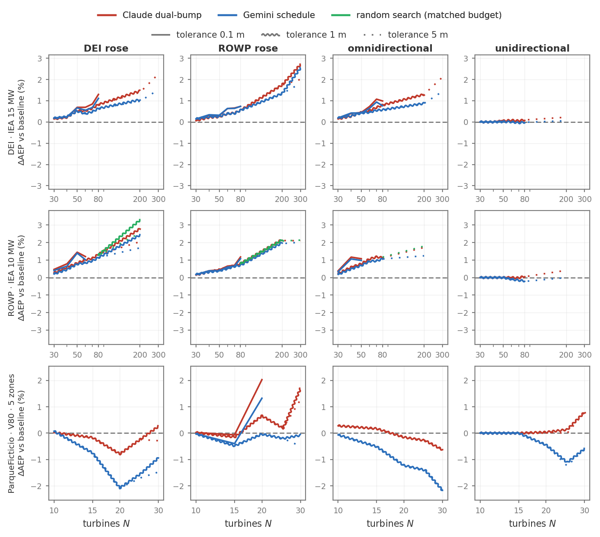
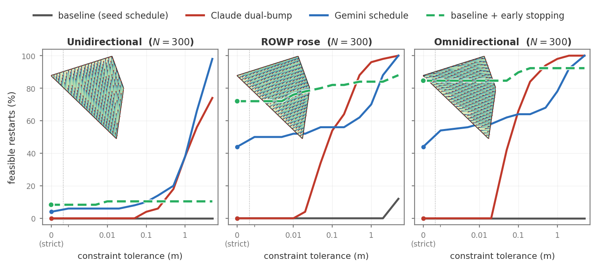

# FunWake: LLM-Discovered Optimizer Schedules for Wind Farm Layout

Wind farm layout optimization is a non-convex constrained problem in
which a half-percent gain in annual energy production (AEP) is worth
millions of dollars per farm. FunWake applies the FunSearch paradigm to
it: LLM coding agents iteratively write optimizer *schedules*, evaluated
on wind farms held out from the search.

The central finding is that constraining the agent helps. An agent
allowed to write only a 4-parameter schedule function, not the full
optimizer, discovers a novel learning-rate schedule that beats a
500-multistart baseline by +24.8 GWh on a held-out farm it never
trained on. And across agent lanes, scaffolding (how much freedom the
agent has) explains more of the outcome than which model is used.

Deployed script: [`results_agent_schedule_only_5hr/iter_192.py`](results_agent_schedule_only_5hr/iter_192.py).

## The problem

Place N turbines to maximize AEP inside the allowed area, subject to two
constraints: every turbine stays inside the inclusion boundary (and out
of exclusion zones), and no two turbines sit closer than a minimum
spacing. AEP is computed from a wind resource (a set of direction and
speed sectors) and a wake model (Bastankhah) for the velocity deficit
behind upstream turbines.

## The FunWake framework

The LLM writes ONLY a schedule function. A fixed skeleton handles grid
initialization, gradients, Adam updates, and constraint penalties: the
[FunSearch](https://deepmind.google/discover/blog/funsearch-making-new-discoveries-in-mathematical-sciences/)
pattern applied to optimizer schedules.

```
Human writes (fixed):          LLM writes (evolved):
  Grid initialization            schedule_fn(step, total, lr0, alpha0)
  Objective + gradients             -> lr, alpha, beta1, beta2
  Adam update rule
  Constraint penalties
```

Each search iteration is a fresh, headless `claude -p` / `gemini -p`
call, run in a loop under a 5-hour wall-clock budget. Context flows
between iterations only through files (memory scaffolding): an
auto-loaded config, a log of past attempts' training AEP, and the
candidate scripts the agent wrote earlier. After each run the agent is
told the script's final AEP, the seed AEP, and whether the layout was
feasible, then writes the next candidate.

The skeleton is TopFarm's SGD solver. Beyond the learning rate and
constraint multiplier, FunWake also lets the agent schedule the Adam
betas. It deliberately omits TopFarm's early-stopping step, so the
schedule itself has to balance objective against constraints all the way
to convergence.

## Wind farm cases

| Role | Farm | Turbines | Notes |
|------|------|----------|-------|
| Train | DEI farm 1 | 50, IEA 15 MW | Danish Energy Island tender |
| Validation (held out) | [IEA ROWP](https://github.com/IEAWindSystems/IEA-Wind-740-10-ROWP) | 74, IEA 10 MW | different polygon, Weibull wind |
| Test | Parque Ficticio | V80 | small multi-zone onshore |

The agent optimizes on the train farm and may check only *feasibility*
(never AEP) on the validation farm. The deployed script is the one with
the best validation AEP that stayed feasible on both. Held-out AEP is
never shown to the agent. Each case is run against four wind roses: the
real DEI and ROWP roses, plus omnidirectional and unidirectional
limiting cases.


*Train (DEI), validation (ROWP), and test (Parque Ficticio) layouts
(top), the four wind roses (middle), and capacity density across the
cases (bottom).*

## Results

### Less freedom, better results

All four lanes use Claude Code and differ only in how much the agent
controls. Constraining the search to schedule-only yields 3x more
attempts, 100% novel code, and the best held-out generalization.

| Approach | Attempts | % Custom | ROWP +GWh (held out) |
|----------|----------|----------|----------------------|
| Full optimize (black box) | 121 | 2% | +20.3 |
| Full optimize (exposed seed) | 124 | 4% | +21.8 |
| Suggested schedule seed | 96 | 18% | +21.1 |
| **Schedule-only (deployed)** | **320** | **100%** | **+24.8** |

Baselines: Training 5540.7 GWh, ROWP 4246.7 GWh (500 multi-start SGD, grid init).

Model choice moves the result less than scaffolding does. At the same
schedule-only scaffold, Claude Code reaches 4271.5 GWh on the held-out
farm and Gemini CLI reaches 4269.3 GWh, a tight cluster; that 2 GWh
model spread is smaller than the 4.5 GWh spread across the four
scaffolds above.

### The schedule search


*Each dot is one candidate schedule run through the fixed skeleton;
filled dots are feasible layouts. Columns are Claude Code and Gemini
CLI; rows are train AEP (DEI) and held-out AEP (ROWP). The solid line
traces the best feasible validation AEP so far, the dashed line is the
500-multistart baseline, and the star marks the deployed schedule.*

### The deployed schedule

Iteration 192 of 320. Best held-out ROWP AEP: **4271.5 GWh (+24.8)**.

```python
def schedule_fn(step, total_steps, lr0, alpha0):
    t = step / total_steps

    # Cosine decay with 5% warmup, 4x initial LR
    lr_base = warmup_then_cosine(t, lr_init=4*lr0)

    # Two Gaussian LR bumps: escape local optima at 50% and 75%
    bump1 = 0.2 * lr_init * exp(-0.5 * ((t - 0.5) / 0.04)**2)
    bump2 = 0.3 * lr_init * exp(-0.5 * ((t - 0.75) / 0.05)**2)
    lr = lr_base + bump1 + bump2

    # Penalty coupled to 1/LR, with intentional dip at t=0.6
    alpha = 5 * alpha0 * lr_init / lr + quadratic_late_boost
    alpha *= (1 - 0.5 * gaussian_dip(t, center=0.6))

    beta1, beta2 = 0.3, 0.5  # moderate momentum
    return lr, alpha, beta1, beta2
```

Full source: [`results_agent_schedule_only_5hr/iter_192.py`](results_agent_schedule_only_5hr/iter_192.py)

**Dual Gaussian LR bumps** briefly increase step size at t=0.5 and
t=0.75, controlled escapes from local optima. Standard schedules decay
monotonically.

**Coordinated alpha dip at t=0.6** relaxes constraint penalties between
the two bumps, letting the layout rearrange before final convergence.
The bumps and dip form a coordinated explore-then-enforce cycle.

**Moderate momentum** (beta1=0.3, beta2=0.5) between TopFarm's lows
(0.1, 0.2) and standard Adam (0.9, 0.999). Converged on after exploring
24 distinct beta pairs.

| Component | Discovered at | Effect |
|-----------|--------------|--------|
| 4x initial LR | iter 23 | Larger exploration basin |
| 5% linear warmup | iter 11 | Stabilizes early Adam |
| Gaussian bump at t=0.5 | iter 120 | Mid-optimization escape |
| Gaussian bump at t=0.75 | iter 124 | Late-stage escape |
| 5x alpha coupling | iter 153 | Stronger constraint enforcement |
| Alpha dip at t=0.6 | iter 183 | Relax constraints between bumps |
| beta1=0.3, beta2=0.5 | iter 93 | Moderate momentum sweet spot |


*All four scheduled parameters over optimization progress, for both
deployed schedules against the baseline. Claude iter_192 uses dual LR
bumps with constant low betas; Gemini iter_118 uses cosine restarts with
cyclic betas.*

### Held-out generalization

The held-out farm differs in turbine (IEA 10 MW vs 15 MW), polygon,
turbine count (74 vs 50), and wind resource (Weibull vs timeseries).
The LLM sees only PASS/FAIL feasibility, never the AEP.

| Case | Turbines | Baseline | Best LLM | Gap |
|------|----------|----------|----------|-----|
| DEI farm 1 (train) | 50, IEA 15 MW | 5540.7 GWh | 5600.0 GWh | +59.3 |
| [IEA ROWP](https://github.com/IEAWindSystems/IEA-Wind-740-10-ROWP) (held out) | 74, IEA 10 MW | 4246.7 GWh | 4271.5 GWh | +24.8 |



*Held-out AEP gain over the baseline across farms, wind roses, and
turbine counts. Each point is the max of 50 optimization starts,
filtered by the advertised constraint tolerance.*

### Feasibility



*Feasible restarts versus constraint tolerance at N=80, per wind rose.
The discovered schedules hold feasibility at tighter tolerances than the
seed-schedule baseline.*

## Limitations

Held-out transfer was demonstrated across offshore farms with different
turbines, layouts, and wind resources (DEI to IEA ROWP). Transfer
degrades on the small multi-zone onshore case (Parque Ficticio): there
the discovered schedules can underperform the baseline. Reported results
come from two agent CLIs (Claude Code and Gemini CLI) and are agent-lane
results (model plus scaffold), not pure model comparisons.

## Process

Coding agents helped build the evaluation infrastructure and ran the
discovery loops. All reported numbers come from frozen baselines,
held-out evaluation farms, and archived run logs in this repository.

## Reproduce

```bash
pixi install && bash setup.sh    # clone pixwake + compute baselines

# Schedule-only mode (best)
pixi run python agent_cli.py \
    --provider claude-code --schedule-only \
    --hot-start results/seed_schedule.py \
    --time-budget 18000
```

Figures are generated by the scripts in [`paper/`](paper/) (`make_fig_*.py`).
See [`CLAUDE.md`](CLAUDE.md) for architecture details and
[`paper/`](paper/) for the manuscript draft.
